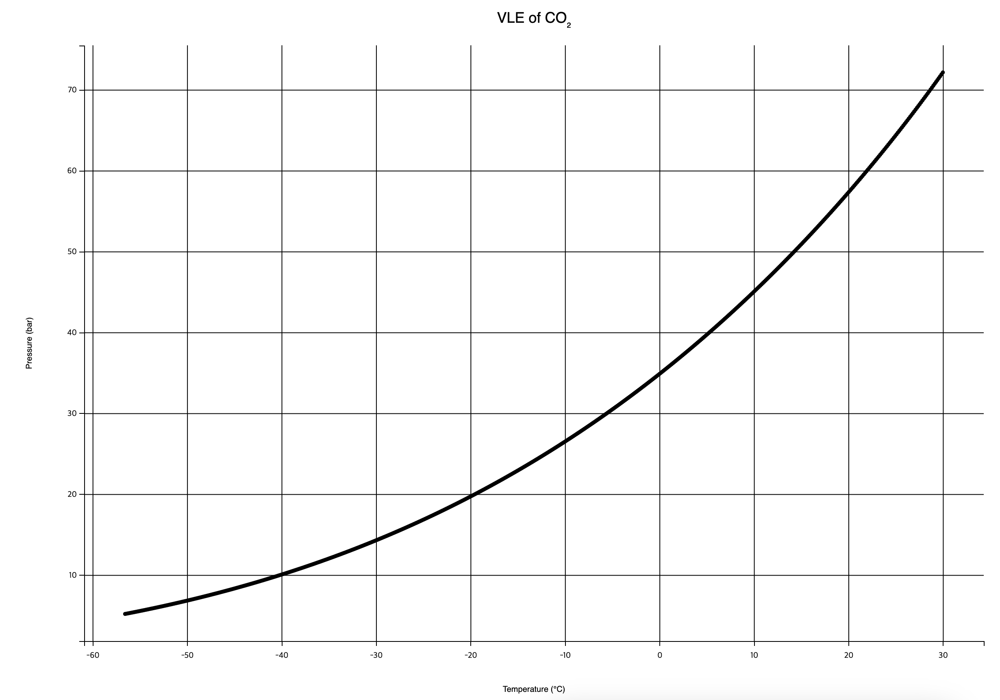

# CO2-VEQ-inter
::The source code for plotting the vapor-liquid equilibrium (VLE) data of CO2 using matplotlib and mpld3 libraries::



## Installation

To use this code, you need to have Python 3 and the following libraries installed:

- matplotlib
- mpld3
- pandas

You can install these libraries using pip by running the following command in your terminal:
```bash
pip install -r requirements.txt
```

## Getting the Data

The data used in this code is obtained from the National Institute of Standards and Technology (NIST) Chemistry WebBook. Here's how you can download the `vapor.csv` file:

1. Go to the [NIST Chemistry WebBook](https://webbook.nist.gov/chemistry/fluid/)
2. Under the "Fluid Properties" section, select "Carbon Dioxide" from the list of substances.
3. Click on "Saturation properties — temperature increments" from the table of contents. Click `Press to Continue` button.
4. Copy the data and make it into a CSV file (I entitled it as `vapor.csv`).

Or, you can just use the [`vapor.csv`](./vapor.csv) file provided in this repository.

## Usage

1. Place the downloaded `vapor.csv` file in the same directory as your Python script.
2. Run the following command in your terminal to execute the script and generate an interactive HTML plot:
    ```bash
    python3 plotvapor.py
    ```

This will generate a file named `vapor.html` in the same directory, which contains the interactive plot.

## Showcase

You can download the [`vapor.html`](./vapor.html) file in this repository to see how the interactive plot looks like.

## License
This project is licensed under the MIT License.